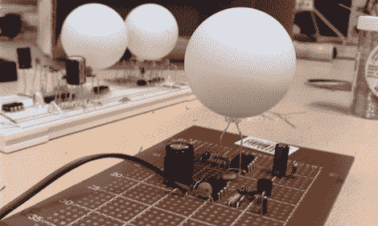

# 异步萤火虫

> 原文：<https://hackaday.com/2011/03/11/async-firefly/>

[dev_dsp]想要尝试创建一个纯模拟实现，由单个电池供电的多个同步萤火虫，并在廉价的原型板上用现成的通孔组件构建。理论上，即使你当地的无线电小屋也应该携带所有这些东西。他显然受到了我们过去报道过的[【亚历克斯】的萤火虫](http://hackaday.com/2009/06/25/64-synchronizing-fireflies/)的启发，但他想看看在不使用微处理器的情况下能走多远。

最终，[dev_dsp]依赖于一个关键的数字软件，即一直很受欢迎的 555 定时器 IC，但他使用模拟分立元件来完成调整每个萤火虫相位的繁重工作，只要检测到附近萤火虫的闪光，就会向触发电容器提供一点额外的电流。在跳转之后，您会发现原理图和三个 ASync-Firefly 模块在不同的组装阶段相互播放的视频演示，同时[dev_dsp]讨论了它们的操作。