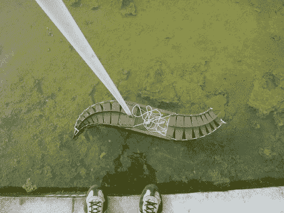

# Protei:关节式反向航行机器人清理漏油

> 原文：<https://hackaday.com/2011/03/12/protei-articulated-backward-sailing-robots-clean-oil-spills/>

Protei 项目旨在开发一种用于清理漏油的机器人解决方案。[塞萨尔原田]辞去他所谓的理想工作，在麻省理工学院致力于解决生态灾难，即石油泄漏。他之前一直在 T2 的 Seaswarm 工作，这是一群机器人，它们使用吸收材料的传送带从海水中吸取石油。但是 Protei 没有使用大量的无人机。它旨在用更好的设计来提高少数单位的效率。

休息后的视频很好地描述了整个想法。如果吸附材料的长拖栅以垂直于流动的蛇形方式被拖曳，从顺流开始并向上移动，它可以非常有效地阻止原油的扩散。初步实验表明，只需稍加改进，机器人船就能有效地做到这一点。首先，为了抵消尾部的阻力，船舵被移到了船头。其次，正如你在上面看到的，船体已经被铰接。这使得机器人可以更好地利用风力来航行，在转弯时不会失去风力。

该项目正在通过 Kickstart 筹集资金，作为一个开放的硬件项目。让我们希望这成为一种廉价而有效的方式来解决我们昂贵的钻井事故。[https://www.youtube.com/embed/vmZ_uy2Ehi4?version=3&rel=1&showsearch=0&showinfo=1&iv_load_policy=1&fs=1&hl=en-US&autohide=2&wmode=transparent](https://www.youtube.com/embed/vmZ_uy2Ehi4?version=3&rel=1&showsearch=0&showinfo=1&iv_load_policy=1&fs=1&hl=en-US&autohide=2&wmode=transparent)