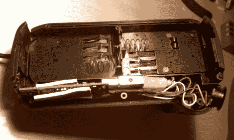

# USB 加密狗黑客系绳 DSLR 相机的一小部分的价格

> 原文：<https://hackaday.com/2011/03/12/usb-dongle-hack-tethers-dsr-cameras-at-a-fraction-of-the-price/>

[Neal]想把他的 DSLR 和他的电脑连接起来，但是他不打算支付尼康索要的 1000 美元的无线适配器。相反，他选择[用两个独立的相机配件构建自己的解决方案](http://www.wirelessnikontether.com/)，完成后花费不到 200 美元。

他购买的两个组件是无线 USB 发射器/接收器对和外部电池手柄。电池把手允许他使用一对电池为他的相机供电，同时提供足够的空间来插入 USB 发射器。他剥掉了发射器的外壳，将它连接到一个迷你 USB 插头上，然后用电线将其插入电池手柄。然后，他添加了一个小型稳压器，将尼康电池电压从 7.2v 降至 USB 发射器所需的 5v。

电池手柄和发射器通过手柄内置的防水插头直接连接到他的相机上。一旦他打开他的相机，它立即连接到电脑。

令人惊讶的是，最简单的方法可以节省大量的金钱。干得好！

请务必观看下面嵌入的视频，了解无线适配器的工作情况。

[https://www.youtube.com/embed/Y7urjotFElo?version=3&rel=1&showsearch=0&showinfo=1&iv_load_policy=1&fs=1&hl=en-US&autohide=2&wmode=transparent](https://www.youtube.com/embed/Y7urjotFElo?version=3&rel=1&showsearch=0&showinfo=1&iv_load_policy=1&fs=1&hl=en-US&autohide=2&wmode=transparent)