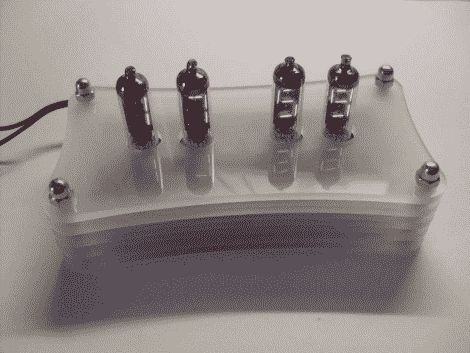

# 时尚的数字时钟显示时间和温度

> 原文：<https://hackaday.com/2011/03/13/sleek-numitron-clock-tells-the-time-and-temperature/>

Instructables 用户[janw]是谢妮钟表的忠实粉丝，但他以前从未制作过钟表。他决定先从小处着手，先用纳米晶体管做一个时钟，然后再转移到尼克斯。他更喜欢简单的电子管，因为它们的电压要求低得多，而且他不必为他的项目使用任何专门的电源。

他的钟有双重功能，也可用作温度计。计时由 DS12307 调节，温度由 DS18B20 单线传感器监控，这两种传感器在此类项目中非常常见。两者都连接到作为时钟大脑的 Atmega48 微控制器。

numitrons 安装在一个漂亮的 5 层丙烯酸酯支架上，底部安装了一对按钮，允许他设置时间。这确实是一款外观壮观的时计，也是 janw 的第一次伟大尝试。

一定要留下来看一个时钟运行的视频。

 <https://www.youtube.com/embed/ZesR6_ZZ9pA?version=3&rel=1&showsearch=0&showinfo=1&iv_load_policy=1&fs=1&hl=en-US&autohide=2&wmode=transparent>

 </body> </html>