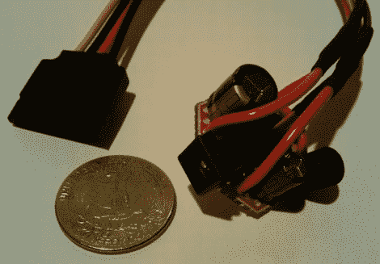

# 迷你 SATA 电源适配器不再需要硬盘扩展坞

> 原文：<https://hackaday.com/2011/03/14/mini-sata-power-adapter-does-away-with-hdd-docking-stations/>

[Marc]对整个硬盘扩展坞相当不满意。他说，它们通常很慢，不可靠，在他对有问题的硬盘进行故障诊断时，给他带来了各种各样的痛苦。他决定解开故障诊断等式中的一些谜团，并构建了一个[独立 SATA 电源模块](http://blog.zorinaq.com/?e=50)。

意识到 SATA 驱动器需要 5v 和 12v 的电压才能工作，他拆卸了一个扩展坞，看看它是如何提供这两种电压的。他发现它使用一个简单的 PWM 降压转换器，并决定在尽可能小的空间内复制它。他的计划是使用一个标准的 12v 壁式电源为电路供电，将 12v 电压直接传递给驱动器。可以构建一个简单的降压电路来提供所需的 5v 电压。

[Marc]报告说电源适配器运行良好，他对尺寸也很满意。他说，这种适配器的一个主要好处是，它可以用于驱动任何 SATA 驱动器，而不仅仅是硬盘驱动器。他确实提到，如果他建造另一个，他可能会考虑调节 12v 输出，这样他就可以用笔记本电脑电源而不是单独的专用壁式电源为适配器供电。