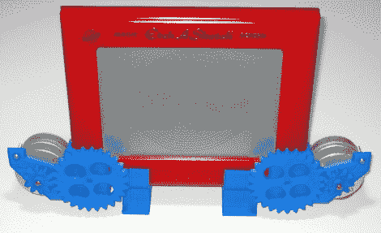

# CNC 蚀刻草图自动绘制

> 原文：<https://hackaday.com/2011/03/14/cnc-etch-a-sketch-draws-on-itself/>

本从来就不擅长素描，他决定是时候驯服这个嘲笑了他很久的儿童玩具了。几年前，他在一次礼物交换中收到了一个，并一直保留着它，最近又把它挖了出来，装上了一些数控部件。

利用他的 RepRap，他打印了一套安装板和齿轮来驱动 Etch-a-Sketch 的表盘。他在齿轮上安装了一对 Airpax 步进器，并将它们连接到他身边的 ATmega AT90 USB 板上。他在微控制器上安装了 RepRap 固件，因为它有一个内置的 gcode 解释器，使他可以轻松地将任何 gcode 文件上传到 Etch-a-Sketch 进行绘制。

你可以在下面看到该设备的快速演示。他将螺旋图像转换成 gcode，然后上传到 Etch-a-Sketch——剩下的工作由机器完成。它画得也很快——[ Ben]甚至暗示他可以让它快速移动到足以融化手写笔的程度！

如果能看到 Etch-a-Sketch 配置成支持在线界面，那就太好了。通过这种方式，他可以允许人们将图像上传到设备上，然后在网络画廊中展示艺术品，这与我们上周介绍的 [LOL Shield Theatre](http://hackaday.com/2011/03/11/lol-shield-theatre-brings-online-video-to-the-pixelated-screen/) 没有什么不同。

[通过[使](http://blog.makezine.com/archive/2011/03/print-your-own-cnc-etch-a-sketch-gears.html)

 <https://www.youtube.com/embed/6UV05jmrK7k?version=3&rel=1&showsearch=0&showinfo=1&iv_load_policy=1&fs=1&hl=en-US&autohide=2&wmode=transparent>

 </body> </html>