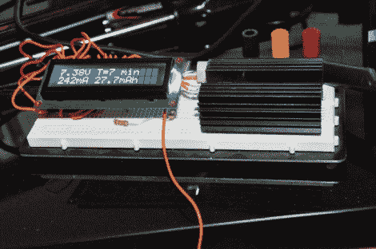

# 电池容量测试仪揭开了制造商容量声明的面纱

> 原文：<https://hackaday.com/2011/03/14/battery-capacity-tester-lifts-the-veil-on-manufacturer-capacity-claims/>

[Nick]的一位老师让他制作一个电池容量测试仪，以测试为 Vex 机器人实验室购买的一些配件电池。这些电池比官方版本便宜，但容量却是官方版本的两倍多。由于对评级相当怀疑，他开始设计他的电路。

他最初计划通过一个电阻给电池放电，并用 PIC 微控制器测量电压。在制作电路原型后，他发现 PIC 没有足够的存储空间来存储他正在收集的数据，并且随着电压的降低，电流波动也存在问题。

他没有被吓倒，他用一个 Teensy 微控制器和一个使用 LM317T 的不同放电电路建立了一个新的测试器。第二个版本不仅包括一个 LCD 屏幕来实时跟踪放电过程，而且它还将所有的数据和计算转储到与 Teensy 相连的计算机上的电子表格中。

根据[Nick]的说法，容量测试仪工作得非常好。他说，大多数电池高估了它们的容量，当测试已知良好的电池时，他的仪表得到的读数在可接受的范围内。那些来自中国的山寨电池呢？他发现，他们可以持有大约一半的电荷，这是一件好事，他决定测试他们！

虽然他提供了用于测试的软件，但没有找到任何原理图。查看我们过去介绍过的[其他](http://hackaday.com/2011/02/10/rechargeable-battery-capacity-tester/)电池容量测试仪中的[部分](http://hackaday.com/2009/11/11/battery-capacity-tester/)，获取自己制作一台的技巧。