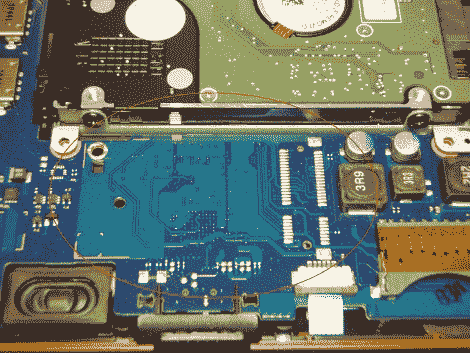

# 没有 PCIE 插槽？加一个就行了

> 原文：<https://hackaday.com/2011/03/15/no-pcieslot-just-add-one/>

[Leslie]喜欢他的小三星 N150 Plus 上网本。虽然它几乎对所有东西都有足够的冲击力，但它缺乏高清视频功能。这就是 Broadcom Crystal HD mini PCI express 卡的用武之地，因为这些小视频解码器只是为需要一些高清爱好的上网本制作的，但问题是，他的上网本只有一个 PCI express 插槽，它被 802.11N 卡占用了。

他没有为此感到沮丧，也不想使用 USB 加密狗设备，他只是撕开了他的上网本，[在主板上的焊盘上添加了第二个 pci express 连接器](http://www.lgutschow.com/samsung-n150-plus-broadcom-crystal-hd-hack)。从 mouser 获得头部，安装似乎很快也很容易，特别是因为三星已经很好地将衬垫镀锡了，所以只要一点点流量和稳定的手感就可以了。

不幸的是，有一些隐藏的问题，因为新安装的插槽不是 Broadcom 卡和 stock wireless N 卡都需要的“全功能”，但他有一个 wireless G 卡，在新添加的插槽中运行得很好，所以现在是时候摇一些全屏高清 Hulu 了。