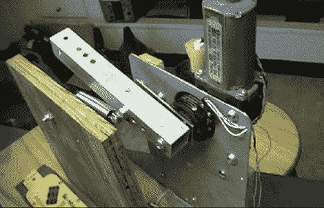

# 自动球发射器是给狗用的

> 原文：<https://hackaday.com/2011/03/15/automatic-ball-launcher-is-for-the-dogs/>

不久前，[迪诺]为他的狗做了一个自动球发射器，但他想修改它，使它更小，更方便用户使用。在看“原型这个”的一集时，他想到了一个改进发射器的好主意，于是他去了工作室。

他从一辆汽车上改装了一个电动车窗电机，并将其安装在车库里的一些木质加固铝板上。他添加了一根铝管作为弹簧加载的发射臂，它由连接到窗户电机的小杠杆拉回。

当一个球落在发射器底部的开关上时，窗户电机开始转动，将发射臂拉回原位。一旦手臂到达临界点，弹簧就会将其向前弹起，将球发射到院子的另一边。连接到车窗电机的控制杆最终回到发射臂下方，并被一个同样连接到电机的开关停止。

原型完成后，他又添加了一些木头来保护机器不受狗的伤害，反之亦然。经过一些训练后，一个漏斗被添加到结构的顶部，以允许狗自己装载发射器。

现在，你们中的一些人可能想知道[迪诺的]手臂出了什么问题。说实话，它工作得很好。如果你是一个经常来访的黑客，你知道他花了很多时间在车间，所以这是一个简单的方法让狗自娱自乐，直到他们的主人准备好玩。

查看下面嵌入的视频，了解发射器的演示，以及该机制如何工作的详细演示。

[https://www.youtube.com/embed/IgyK0C_oHPI?version=3&rel=1&showsearch=0&showinfo=1&iv_load_policy=1&fs=1&hl=en-US&autohide=2&wmode=transparent](https://www.youtube.com/embed/IgyK0C_oHPI?version=3&rel=1&showsearch=0&showinfo=1&iv_load_policy=1&fs=1&hl=en-US&autohide=2&wmode=transparent)