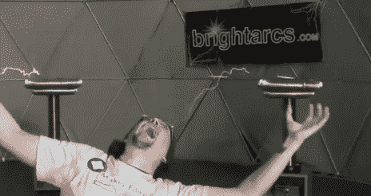

# 邪恶天才模拟器:Kinect 控制的特斯拉线圈

> 原文：<https://hackaday.com/2011/03/15/the-evil-genius-simulator-kinect-controlled-tesla-coils/>

伦敦 Hackspace 的工作人员在 Makefair 2011 上运行他们的 Kinect 演示时遇到了困难。在酒吧时，他们有了用亮弧特斯拉线圈组合力量的想法，并制作了[邪恶天才模拟器](http://www.tomscott.com/evilgenius/)！

在获得 Brightarcs 的许可和线圈的输入规格后，他们在 Openframeworks 中开发了一个应用程序，该程序使用骨骼跟踪数据来确定手的位置。手的位置在两个手动设置的校准条之间缩放(见下面的视频)。然后，缩放后的位置加速或减速 50Hz 的 WAV 文件，以产生每个线圈所需的 50-200Hz 的 sin 波。它只花了一个小时，但结果是辉煌的，视频后跳转。

Kinect 上有[所有](http://hackaday.com/2011/03/14/3d-modeling-out-of-thin-air/) [这些](http://hackaday.com/2011/03/10/kinect-hacked-to-work-with-garrys-mod-means-endless-hours-of-virtual-fun/) [以前的](http://hackaday.com/2011/03/07/chilling-drinks-with-your-friends-faces/) [精选](http://hackaday.com/2011/01/26/ros-gains-full-body-telemetry/) [故事](http://hackaday.com/2011/02/28/encase-yourself-in-carbonite-with-kinect/)，我们已经看到了[对音乐做出](http://hackaday.com/2008/12/07/tesla-coil-guitar-amp/)反应的特斯拉线圈、[制造](http://hackaday.com/2008/06/12/singing-tesla-coils/)音乐的线圈，甚至 MIDI 控制的[线圈](http://hackaday.com/2007/08/06/back-from-vegas-extra/)，很高兴看到这一切结合在一起。

感谢[马特劳埃德]的提示！

 <https://www.youtube.com/embed/aNN4Oo0KhZo?version=3&rel=1&showsearch=0&showinfo=1&iv_load_policy=1&fs=1&hl=en-US&autohide=2&wmode=transparent>

 </body> </html>