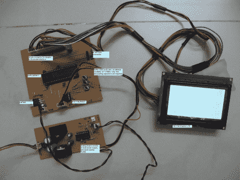

# 基于 DsPIC 的频谱分析仪

> 原文：<https://hackaday.com/2011/03/16/dspic-based-spectrum-analyzer/>

[Debraj]写信给我们描述了他最近完成的一个项目——一个使用 16 位 dsPIC 微控制器的简单、紧凑的[频谱分析仪。](http://sites.google.com/site/hobbydebraj/home/dspic-based-spectrum-analyzer)

分析仪输入一个模拟信号，该信号通过一个大电阻后接一个运算放大器。然后对信号施加 DC 偏移，之后信号通过软件可编程增益放大器，然后馈入 dsPIC 的模拟输入端。一旦收集了 128 个样本，就使用 PIC 制造商提供的代码进行快速傅立叶变换计算。结果会实时显示在连接的 LCD 上。

如果有机会，请观看下面嵌入的视频，了解他的分析器的演练和演示。[Debraj]说，该分析仪是为测量他家电力线中的谐波而设计的，但为了演示，他使用了一个简单的函数发生器。

如果你有兴趣看一些其他的频谱分析仪，一定要看看[这些项目](http://hackaday.com/2011/01/08/pic-spectrum-analyzer-uses-fast-fourier-transform-routine/)我们在过去展示过[。](http://hackaday.com/2010/07/29/graphic-calculator-as-a-spectrum-analyzer/)

 <https://www.youtube.com/embed/5PXJZYuQ6eE?version=3&rel=1&showsearch=0&showinfo=1&iv_load_policy=1&fs=1&hl=en-US&autohide=2&wmode=transparent>

 </body> </html>