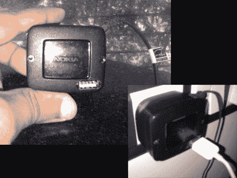

# 手机充电器上有一个 USB 接口

> 原文：<https://hackaday.com/2011/03/16/cellphone-charger-has-a-usb-port-forced-upon-it/>

我们仍然不明白为什么没有为手持设备开发标准的充电方案(除了 greed)。当然，我们知道许多设备在电压和电流方面有不同的用电需求，但我们仍然渴望能够将一个充电器用于许多不同的小玩意。[Rupin]试图通过给他的诺基亚手机充电器增加一个 USB 充电端口来减少他使用的专用充电器的数量。由于 USB 标准要求调节 5V 电压，这样的黑客通常只需将设备插头外壳中的电压调节器的电源输出接入即可。[Rupin 的]充电器外壳上印有 5V，但当他探测输出时，他发现远远超过 8v。他添加了一个 7805 线性调节器，以获得他需要的稳定输出，然后在外壳上切了一个洞，以容纳连接器。

因为[Rupin]想把它用作 iPod 充电器，他不能让两条数据线悬空。苹果使用一种特殊的充电器验证方案，需要一些分压器来让设备开始充电。