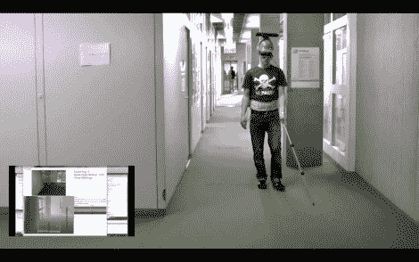

# 用 Kinect 给视障人士带来“视觉”

> 原文：<https://hackaday.com/2011/03/16/giving-sight-to-the-visually-impaired-with-kinect/>

在过去的几个月里，我们已经看到 Kinect 被以各种巧妙的方式使用，但是[康斯坦茨大学]的一些学生已经将 Kinect 黑客技术提升到了一个全新的水平。他们不是用它来[控制闪电](http://hackaday.com/2011/03/15/the-evil-genius-simulator-kinect-controlled-tesla-coils/)或[用 Garry 的 Mod 踢一些盒子](http://hackaday.com/2011/03/10/kinect-hacked-to-work-with-garrys-mod-means-endless-hours-of-virtual-fun/)，而是用它来为视障人士开发导航辅助设备，简称 NAVI。

一个安装在头盔上的 Kinect 传感器被放置在受试者的头部，并与笔记本电脑相连，笔记本电脑存储在用户的背包中。Kinect 使用定制软件进行接口，该软件利用深度信息来生成环境的虚拟地图。电脑向 Arduino 板发送信息，然后将这些信号转发给三个安装在腰带上的 LilyPad Arduinos 中的一个。LilyPads 控制三个电机，这些电机会振动，以提醒用户注意障碍物。该小组甚至通过专门的标记添加了语音通知，允许它们提示用户存在门和其他特定的注意事项。

这确实是 Kinect 传感器的一个很好的用途，我们迫不及待地想在未来看到更多这样的项目。

留下来看看 NAVI 在使用中的快速视频。

[via[Kinect-Hacks](http://www.kinect-hacks.com/kinect-news/2011/03/15/navi-using-kinect-aid-visually-impaired-navigate-indoor-environments)–谢谢，贾里德]

 <https://www.youtube.com/embed/l6QY-eb6NoQ?version=3&rel=1&showsearch=0&showinfo=1&iv_load_policy=1&fs=1&hl=en-US&autohide=2&wmode=transparent>

 </body> </html>