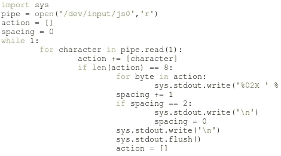

# 为输入设备编写 Python 驱动程序

> 原文：<https://hackaday.com/2011/03/17/writing-python-drivers-for-input-devices/>

[Stealth]写了一篇文章解释了[他是如何为输入外设](http://www.stealth-x.com/programming/driver-writing-with-python.php)编写驱动程序的。他正在使用 Python，这使得这个过程变得相当容易(我们马上就会谈到这一点)，但他的帖子的价值在于围绕如何解释数据的解释。一旦你知道通信是如何从一个设备来的，你就可以用任何你想要的语言来编写驱动程序。[Stealth]在阅读了 [PlayStation 3 Sixaxis 控制器嗅探黑客](http://hackaday.com/2011/03/11/all-about-ps3-sixaxis-controller-usb-communications/)后写信告诉我们这个帖子。他几乎在做同样的事情，但是背景信息更加丰富。

这个过程有几个先决条件。首先，[Stealth]是在 Linux 环境下工作的。这并不是说你不能在另一个操作系统上这样做，但你需要做一些研究，找出如何利用设备的数据流。其次，您正在使用的输入必须已经在机器上设置好并正在运行。这意味着如果没有任何外围设备(在这种情况下是 USB 操纵杆)的支持，你将无法嗅出命令。也就是说，只需一小段 Python 代码就可以转储来自设备的原始数据。有了数据，是时候做一些模式搜索了。当您开始计算传入数据包的大小和范围时，您可以尝试自己的代码，以确保正确无误。休息之后，请观看演示视频，视频中有一个用 Python 编写的操纵杆按钮映射器。

 <https://www.youtube.com/embed/WYaSHPWjU_E?version=3&rel=1&showsearch=0&showinfo=1&iv_load_policy=1&fs=1&hl=en-US&autohide=2&wmode=transparent>

 </body> </html>