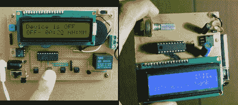

# LCD Twofer

> 原文：<https://hackaday.com/2011/03/17/lcd-twofer/>

廉价的字符液晶显示器是许多项目中输出数据的流行选择。易于控制，通常采用背光照明，并且结构紧凑。如果你还没有找到买一个的理由，这里有几个。

首先是一个 P [可编程数字定时器开关](http://embedded-lab.com/blog/?p=1378)。基于 PIC15f628A 微控制器，这个方便的小设备允许你通过继电器设置开关时间来切换(轻型)设备。一个标准的 16×2 LCD、压电蜂鸣器和 4 个按钮提供了该设备的 I / O。这 4 个按钮被分配为开/关时间、选择、输入和启动/停止，便于任何人使用。所有这一切和运动的一个干净的 perf-board 布局，往往走出了窗口时，使用跳线。

接下来为 AVR 人群准备的是一个 [LCD 姓名徽章](http://www.instructables.com/id/AVR-LCD-Namebadge/)。由 Attiny 2313 驱动，使用另一个 16×2 LCD，这次是蓝色的，这个大而实用的名称徽章随时准备提供人们需要的关于你的所有信息，同时吹嘘你的书呆子信用。

两者都有源代码和原理图，是的，我们知道这些小工具并不完全是惊天动地的，所以这就是为什么我们邀请你在可能是有史以来最棒的论坛上分享你的 LCD 项目， [Hack A Day forums，](http://forums.hackaday.com/)我们甚至有一个仅用于项目日志的小点设置。

但是休息之后先来看几个短片。

[https://www.youtube.com/embed/2sqcIDupEhg?version=3&rel=1&showsearch=0&showinfo=1&iv_load_policy=1&fs=1&hl=en-US&autohide=2&wmode=transparent](https://www.youtube.com/embed/2sqcIDupEhg?version=3&rel=1&showsearch=0&showinfo=1&iv_load_policy=1&fs=1&hl=en-US&autohide=2&wmode=transparent)

[https://www.youtube.com/embed/qHc7IbYLTcM?version=3&rel=1&showsearch=0&showinfo=1&iv_load_policy=1&fs=1&hl=en-US&autohide=2&wmode=transparent](https://www.youtube.com/embed/qHc7IbYLTcM?version=3&rel=1&showsearch=0&showinfo=1&iv_load_policy=1&fs=1&hl=en-US&autohide=2&wmode=transparent)