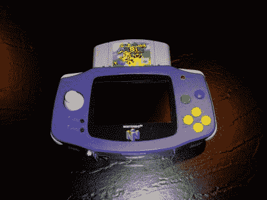

# n64 男孩前进

> 原文：<https://hackaday.com/2011/03/17/n64boy-advance/>

[Hailrazer]在他的衣柜里发现了一个 Game Boy Advance 手提箱，并认为他可以在几个周末内完成一个 [N64Boy Advance](http://moddedbybacteria.freeforums.org/hailrazer-s-n64boy-advance-video-added-t1427.html) 。尽管构建时间很快，但[Hailrazer]构建的东西放在玩具店的货架上也不会显得格格不入。

这不是我们第一次报道使用 GBA 便携包的 N64 Advance 便携式游戏系统，但这次黑客保留了 Game Boy Advance 的原始风格，没有所有的环氧树脂、bondo 和打磨。里面是一个 4.3 英寸的屏幕，GameCube 操纵杆，N64 扩展包，以及足够的锂离子电池，可以玩 5-6 个小时。这个版本不包括一个 D-pad，因为[Hailrazer]在玩的时候不使用它。它也没有控制器或 A/V 端口，因为他不想“和朋友坐在一起，在 4.3 英寸的屏幕上玩 N64。”确实是一座非常实用建筑。

我们喜欢看到人们重新利用他们扔在周围的塑料碎片，所以我们想知道什么时候有人会带着一个最初的游戏机手提袋来制造 NESBoy。跳跃后的视频。

 <https://www.youtube.com/embed/dgyzuFMfJ4Q?version=3&rel=1&showsearch=0&showinfo=1&iv_load_policy=1&fs=1&hl=en-US&autohide=2&start=40&wmode=transparent>

 </body> </html>