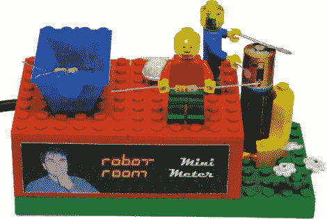

# 乐高迷你万用表使电阻排序更有趣

> 原文：<https://hackaday.com/2011/03/17/lego-minifig-multimeter-makes-resistor-sorting-a-lot-more-fun/>

虽然我们的工作台上通常没有太多的空间放玩具，但机器人室的[David]已经[组装了一个非常酷的万用表](http://www.robotroom.com/Minifigure-Multimeter.html)，我们将为它破例。

他的乐高迷你图万用表主要是用标准的现成乐高积木和一对他改造的迷你图来满足他的需求。半透明的迷你图头部是从网上获得的，以允许安装在脖子上的发光二极管照射进来，每个身体都在几个地方钻了孔，以容纳他用来进行测量的电线。

万用表将显示 10–10，000，000ω范围内的任何项目的电阻，并测量您可以在 Minifig 的金属扳手下安装的任何电池的电压。万用表使用 ATmega168 进行测量，并通过连接到附近计算机的串行到 USB 转换器传递数据。这台计算机是他编写的一个. NET 应用程序的宿主，这个应用程序可以显示和读出电阻值和电压值。

请继续阅读，观看快速视频演示和万用表的工作演示。

 <https://www.youtube.com/embed/d-Oc3YLc7GM?version=3&rel=1&showsearch=0&showinfo=1&iv_load_policy=1&fs=1&hl=en-US&autohide=2&wmode=transparent>

 </body> </html>