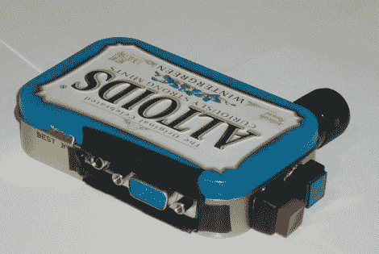

# AV 测试盒遇到难以置信的收缩射线

> 原文：<https://hackaday.com/2011/03/17/av-test-box-meets-the-incredible-shrink-ray/>

[Chris]最近完成了一个[微型 AV 测试盒](http://www.pyroelectro.com/projects/audio_video_tester/index.html)，能够放入标准的 Altoids 罐中。这是对他几年前建造的[项目](http://hackaday.com/2007/11/13/simple-vga-test-box/)的修订。他以前的测试盒工作得很好，但是又大又笨重——绝对不是你想经常随身携带的东西。

新的测试盒能够完成其前身能够完成的一切，包括显示 800×600 VGA 测试模式，以及生成用于测试音频系统的声音信号。他对电路设计进行了一点更新，采用了更新的 PIC 处理器来运行该节目，除此之外，大多数设计细节都保持不变，外形因素除外。

像往常一样，他的构建日志充满了细节。你会发现他使用的所有组件的详细描述，原理图，源代码，以及背后的理论建设。

请务必查看下面嵌入的视频，了解他的新 AV 测试器的运行情况。

 <https://www.youtube.com/embed/HLpqeAnONc8?version=3&rel=1&showsearch=0&showinfo=1&iv_load_policy=1&fs=1&hl=en-US&autohide=2&wmode=transparent>

 </body> </html>