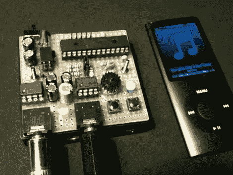

# 音高移位器让你的乐队唱得更高

> 原文：<https://hackaday.com/2011/03/17/pitch-shifter-makes-your-band-sing-higher/>

[Markus Gritsch]向我们透露了他构建的这个小模块，用于改变音频播放的音高。它使用 PIC 24FJ 和几个 LM386 放大器芯片来管理输入和输出信号。按下一个按钮，通过设备输入的音频可以调制到不同的键，而不改变回放速率。这里它与 iPod 一起使用，但因为这个设备只是位于音频源和信号输入之间，我们想知道你是否可以通过这个电路在手机上获得一些乐趣？

休息之后，请观看视频，了解实际情况。我们必须称赞[马库斯]的布局。我们还没有看到原型板的底部，但他已经做了很好的工作，将所有东西都放入一个小区域。您可以通过此功能顶部的链接找到电路原理图。他拍了一张他的手绘计划的照片，这节省了他用类似 [KiCAD](http://hackaday.com/2011/03/10/thursday-give-kicad-a-try-heres-how/) 的东西来展示的时间，但仍然给了我们我们喜欢看到的你的项目的细节。

 <https://www.youtube.com/embed/_KwS2qCCGzs?version=3&rel=1&showsearch=0&showinfo=1&iv_load_policy=1&fs=1&hl=en-US&autohide=2&wmode=transparent>

 </body> </html>