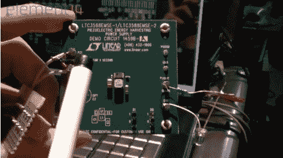

# 免费能源是给傻子用的？

> 原文：<https://hackaday.com/2011/03/17/free-energy-is-for-fools/>

在她的新 element-14 视频[Jeri Ellsworth] [中，她解释了一些关于“免费”能源的概念](http://www.element-14.com/community/groups/jeri-ellsworth?view=overview)，并展示了 LTC3109EUF，一种自动极性、超低电压升压转换器和电源管理器，以及 LTC3588EMSE 一种压电能量收集电源。

使用 LTC3109EUF，她能够使用一个小型发电机和一辆健身车为修改后的任天堂娱乐系统和 LCD 供电。LTC3588EMSE 连接到不同应用中的压电器件，包括挤压、振动和温差，为低电流设备供电。

所有这些和一个完全 80 年代的主题，所以噗起来你的头发，让你的尖刺狗项圈，并找到那些霓虹绿色的阴影，因为这是一个有趣和翔实的元素 14 上可用的视频。