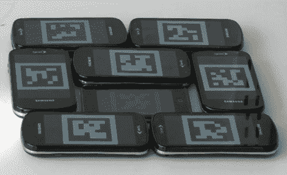

# 垃圾场大屏幕正在乞求一个开源项目克隆

> 原文：<https://hackaday.com/2011/03/18/junkyard-jumbotron-is-begging-to-for-an-open-source-project-clone/>

世界上的空闲开发者从这个项目中获得灵感，并联合起来创建自己的版本。它被称为垃圾场大屏幕，因为它可以容纳许多不同的显示器，并允许它们作为一个大型互动显示器使用。上图显示了一组显示测试模式的智能手机。该模式对于每个设备都是唯一的，并且用于校准显示器。使用数码相机拍摄这些测试模式的照片，然后发送到服务器。服务器计算每个屏幕的位置，然后将大图像的正确片段发送回每部手机。

有趣的是，他们在软件的名字中使用了垃圾场这个词。每台显示器都需要能够运行网络浏览器，这样你就不能只使用垃圾显示器了。但硬件要求的一个好的副作用是，休息后你仍然可以像视频中看到的那样平移和缩放。真正的问题是:你能把它作为一个开源项目吗？可以很容易地设置成与 LAMP 服务器一起工作的东西怎么样？

<https://player.vimeo.com/video/20962561>

 
[via <a href="http://www.reddit.com/r/programming/comments/g55qt/the_junkyard_jumbotron_lets_you_take_a_bunch_of/" target="_blank"> Reddit </a>
 </body> </html>