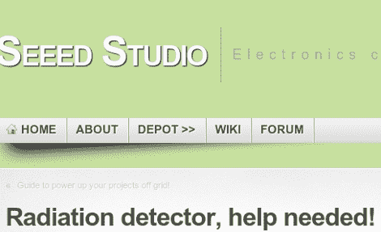

# Seeed 寻求开发开源辐射探测器的帮助

> 原文：<https://hackaday.com/2011/03/18/seeed-looks-for-help-developing-an-open-source-radiation-detector/>

Seeed 工作室、Seeeduino 的制造商和小批量 PCB 订单的制造商已经呼吁[帮助开发开源辐射探测器](http://www.seeedstudio.com/blog/2011/03/16/radiation-detector-help-needed/)。这对处于危险中的日本地区的人们有帮助吗？我们真的不能说。但如果你能在这方面提供一些专业知识，这不会有什么坏处。我们已经看到了[一个简单的剂量计项目](http://hackaday.com/2011/03/17/quick-and-dirty-film-dosimeter/)，但这个听起来更像是 DIY 盖革计数器的水平。我们知道这是可能的，但是[我们在 2007 年看到的被黑在一起的单元](http://hackaday.com/2007/11/19/digital-geiger-counter/)几乎没有文档，并且使用了可能很难得到的部件。

需要的具体信息是使用什么类型的传感器，应该包括什么支持电路，以及校准每个单元的最佳方法。在那篇文章的评论里有一个讨论，即使你认为你没有什么要补充的，读起来也应该很有趣。

[谢谢迈克尔]