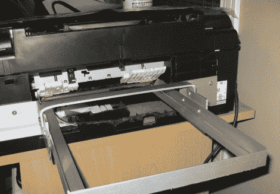

# 直接到 PCB 抗蚀印刷需要最少的附加元件

> 原文：<https://hackaday.com/2011/03/18/direct-to-pcb-resist-printing-requires-minimal-additional-components/>

使用墨粉转移法印刷 PCB 效果很好，但也有一些缺点，如不完全的痕迹转移等。HackHut 用户[rucalgary] [决定走喷墨路线而不是](http://rucalgary.hackhut.com/2011/03/06/epson-pcb-printer-hackmod/)，并在当地电子商店清仓时买了一台爱普生打印机。[这种方法无论如何都不是新的](http://hackaday.com/2010/11/14/direct-to-pcb-inkjet-printing-2/)，但他的打印机转换是我们见过的最简单的，因为它不依赖任何[附加传感器来运行](http://hackaday.com/2011/02/28/direct-to-pcb-etch-resist-printing/)。

一回到家，他就立即拆掉了打印机，卸下了纸张输入和输出托盘以及扫描仪平台。在所有无关的部分都被移除后，他开始抬起打印头，以及打印头支撑机构。他提到后一个组件对于后续的正常功能是绝对重要的。一旦打印头及其相关组件被重新定位，他添加了一对铝轨道，用于将他的打印托盘送入机器。

一切完成后，他在一个备用墨盒里装满了墨水(他说 MISPRO yellow 效果最好),并运行了一些测试板。他对事情的结果非常满意，并非常乐意通过下面的视频带您快速参观他完成的打印机。

[https://www.youtube.com/embed/Y58AIUAJlj0?version=3&rel=1&showsearch=0&showinfo=1&iv_load_policy=1&fs=1&hl=en-US&autohide=2&wmode=transparent](https://www.youtube.com/embed/Y58AIUAJlj0?version=3&rel=1&showsearch=0&showinfo=1&iv_load_policy=1&fs=1&hl=en-US&autohide=2&wmode=transparent)