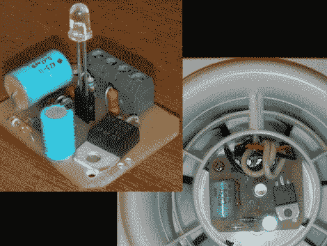

# 给你的浴室风扇加一个关闭定时器

> 原文：<https://hackaday.com/2011/03/19/add-a-shutoff-timer-to-your-bathroom-fan/>

给你的浴室风扇加上这个板子 ( [翻译](http://translate.google.com/translate?js=n&prev=_t&hl=en&ie=UTF-8&layout=2&eotf=1&sl=auto&tl=en&u=http%3A%2F%2Farv.radioliga.com%2Fcontent%2Fview%2F218%2F44%2F))会让它变成一个智能设备。它被设计成在清除室内湿气一段时间后自动关闭风扇。它取代了通常控制这些风扇的墙壁开关，将风扇连接转换为始终连接到电源。电路板通过半波整流电路获得恒定功率，以保持 ATtiny13 运行。从印刷电路板中心升起的一个 LED 灯亮起，表明风扇正在运转，但它也用作光传感器，类似于几天前的 LED 通信黑客的[。当浴室的灯亮了，微控制器会通过一个三端双向可控硅开关打开排气扇。它会一直亮着，直到浴室的光线减弱。](http://hackaday.com/2011/03/15/picaxe-using-leds-to-communicate/)

有一种有趣的计时算法可以延迟风扇的启动，并根据浴室灯亮的时间长短来改变风扇在黑暗中停留的时间。这样，更长时间的淋浴(这将建立更多的湿度)将导致风扇保持打开五分钟，加上每两分钟浴室使用一分钟。非常聪明，如果你的浴室看到来自几个家庭成员的高流量，这非常有用。