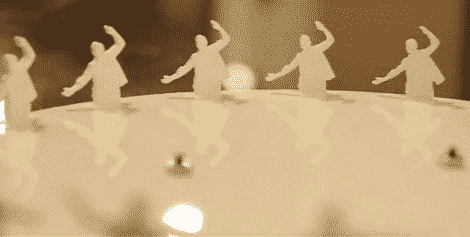

# 使用 Kinect、处理和激光切割机构建一个 Zoetrope

> 原文：<https://hackaday.com/2011/03/19/building-a-zoetrope-using-kinect-processing-and-a-laser-cutter/>

zoetrope 是一种设备，它包含一个装满一系列图像和动画的磁盘。有几种不同的方法可以用来欺骗眼睛看到一个单一的动画图像。在过去，这是通过将图像放在一个有规则距离狭缝的圆柱体内来实现的。当快速旋转时，狭缝看起来是静止的，图像创建动画。但是使用闪光灯也可以达到同样的效果。

你在上面看到的圆盘使用了频闪方法，但是它的设计和构造吸引了我们的眼球。动画形状[由 Kinect 捕捉，并通过处理](http://blog.makezine.com/archive/2011/03/making-a-laser-cut-zoetrope-with-processing-and-kinect.html)分离出来。[Greg Borenstein]拍摄了一部有人在 Kinect 前跳舞时录制的深度电影。他运行了一个处理草图，并能够分离出一组幻灯片，然后用激光切割机变成上面看到的物体。

休息之后，你可以观看这个特殊的窥镜的视频。但是我们也嵌入了 Pixal 3D zoetrope 剪辑，虽然与这次黑客攻击无关，但是非常有趣。没有激光切割机自己尝试一下？您总是可以构建一个使用打印磁盘的 zoetrope。

Kinect 录制的激光切割窥镜:

[https://player.vimeo.com/video/20542749](https://player.vimeo.com/video/20542749)

Pixal 3D 雕塑作品 zoetrope:

[https://www.youtube.com/embed/5khDGKGv088?version=3&rel=1&showsearch=0&showinfo=1&iv_load_policy=1&fs=1&hl=en-US&autohide=2&wmode=transparent](https://www.youtube.com/embed/5khDGKGv088?version=3&rel=1&showsearch=0&showinfo=1&iv_load_policy=1&fs=1&hl=en-US&autohide=2&wmode=transparent)