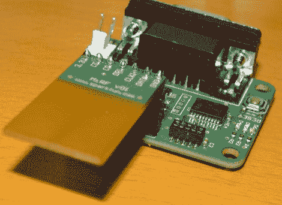

# 构建家庭自动化网状网络

> 原文：<https://hackaday.com/2011/03/19/building-a-home-automation-mesh-network/>

[Ian Harris]用 X10 硬件为他的父母设计了一堆家庭自动化。他对模块的故障率和系统的整体性能有点失望，所以他开始用自己的硬件替换它。幸运的是，他在关于网状网络的四集系列中记录了这段旅程。

上面看到的硬件是他的试验台。他正在使用几个 Sparkfun 分线板来开发 nrf2401a 射频收发器芯片。这些可以用作带有中央命令设备的从属模块，但是由于房屋的结构，无线信号不能很好地从房屋的一端传播到另一端。解决方案是建立一个网状网络，允许每个模块充当一个网络节点，接收和传递消息，直到它们到达目标设备。他试图用廉价的硬件来实现这一点，选择了 PIC 16F88，它拥有 7 KB 的程序存储器和 368 字节的 ram。最后，让它运行起来并不需要太多的代码，只是在你熟悉这些概念之前，需要花一些时间和研究。

[感谢奥克卡 7]