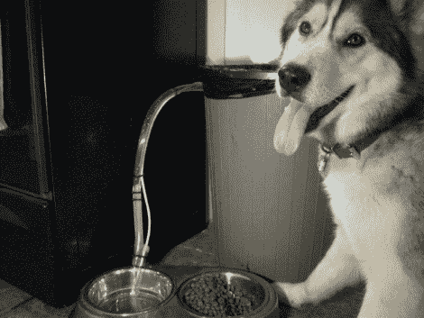

# 自动狗食灌装机永不干涸

> 原文：<https://hackaday.com/2011/03/18/automatic-dog-dish-filler-never-goes-dry/>

[Avatar-X]有一只西伯利亚哈士奇，它整天都在做大量的运动，正如你所想象的，它也喝了一吨的水。我们都有记忆缺失的时候，虽然他通常很好地保持碗满，但他偶尔会忘记。他已经尝试了一些不同的自动填充狗盘子，但没有一个看起来工作得很好，它们经常迅速建立健康的细菌菌落。

在一些朋友的帮助下，他装配了一个自动水盘灌装机，确保他的小狗总是有足够的水供应。他用一个标准的冰箱连接套件接入厨房供水系统，并把一些管道接入他的橱柜，在那里他放置了一个花园灌溉阀。阀门由 Arduino 控制，Arduino 通过一对电线感应马桶的水位。

如果下面嵌入的视频是任何指标，该系统看起来工作得很好。[Avatar-X]在他的网站上提供了水控制电路的代码和示意图，免费提供给任何想为他们的宠物建造类似系统的人。

如果你有兴趣了解更多关于自动化你的宠物护理的信息，一定要看看[这些](http://hackaday.com/2010/07/17/rfid-cat-feeder-helps-with-the-diet/) [的黑客](http://hackaday.com/2010/05/20/automatic-fish-feeder/)我们[过去精选的](http://hackaday.com/2009/12/03/internet-enabled-cat-feeder/)。

 <https://www.youtube.com/embed/I0KnQjQzAF0?version=3&rel=1&showsearch=0&showinfo=1&iv_load_policy=1&fs=1&hl=en-US&autohide=2&wmode=transparent>

 </body> </html>