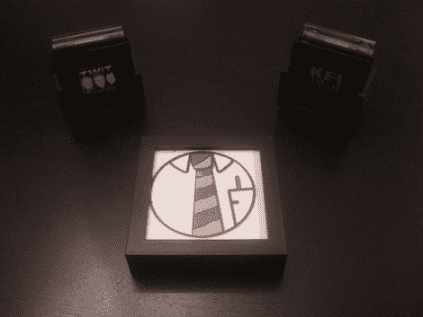

# 基于 RFID 的 HTPC 控制器获得无线更新

> 原文：<https://hackaday.com/2011/03/20/rfid-based-htpc-controller-gets-a-wireless-refresh/>

[roteno]最近写信告诉我们，他已经完成了关于[RFiDJ Refresh](http://roteno.com/?q=RFiDJ_Refresh)的工作，这是他 2009 年项目[RFiDJ](http://hackaday.com/2009/11/09/coaster-controlled-htpc/)的后续工作。

这个概念非常简单——他有一组支持 RFID 的磁贴，其中包含对特定在线流媒体音频站的引用。他把这些瓦片放在一个装有 RFID 阅读器的积木上，就可以调谐到他的 HTPC 上的音频信号。

他之前的实现将 RFID 阅读器绑在他的 HTPC 上，这并不方便使用。新版本利用 433 MHz 的发射器/接收器对与电脑进行通信，因此可以在家中任何地方使用。读取器和发射器被放置在一个阴影盒相框中，同时还有一个可充电的锂电池为整个装置供电。他还提到，他增加了一个触觉界面，允许他从 RFiDJ 发起移动电话呼叫。

对于一个已经很棒的项目来说，这是一个很好的更新。我们认为，对[roteno]和他的客人来说，在发射机盒上敲击杯垫比在 HTPC 上摸索着用遥控器换电台更有趣，但这只是我们的想法。

看看下面的视频，看看他的新设置。

 <https://www.youtube.com/embed/3QKfRvmLtYg?version=3&rel=1&showsearch=0&showinfo=1&iv_load_policy=1&fs=1&hl=en-US&autohide=2&wmode=transparent>

    <iframe class="youtube-player" width="800" height="480" src="https://www.youtube.com/embed/oeGls2F_Bgg?version=3&amp;rel=1&amp;showsearch=0&amp;showinfo=1&amp;iv_load_policy=1&amp;fs=1&amp;hl=en-US&amp;autohide=2&amp;wmode=transparent" allowfullscreen="true" style="border:0;" sandbox="allow-scripts allow-same-origin allow-popups allow-presentation"/> 
 </body> </html>