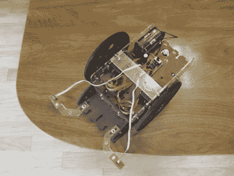

# 简单的机器人知道它的界限

> 原文：<https://hackaday.com/2011/03/21/simple-robot-knows-its-bounds/>

[达拉斯个人机器人小组]最近为他们的成员整理了一套教程，包括一个桌面机器人的建造过程，他们称之为[小流浪者](http://www.instructables.com/id/Tiny-Wanderer-A-Table-Top-Robot/)。该机器人可以很容易地建造，这是机器人制造的入门。

这个小型伺服驱动机器人使用简单的边缘传感器来确保它不会从凸起的表面上掉下来。传感器是用一个小的红外 LED 和光电晶体管制成的，通过一根收缩管与 LED 部分隔离。ATiny 微控制器对进入光电晶体管的红外光量进行两次测量——一次在 LED 开启时，另一次在 LED 关闭时。比较这些测量值的差异，以确定边缘传感器是否悬挂在桌子的侧面。这里使用的逻辑非常简单——由于反射光，如果传感器悬停在表面上方，差异将会很大，如果传感器悬挂在开放空间上方，差异将会很小。

该报告包含用于构建机器人结构的模板，以及所有电子元件的源代码和原理图。

一定要留下来看看机器人的视频。

 <https://www.youtube.com/embed/k_nPAFHxOYY?version=3&rel=1&showsearch=0&showinfo=1&iv_load_policy=1&fs=1&hl=en-US&autohide=2&wmode=transparent>

 </body> </html>