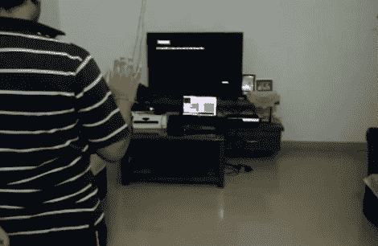

# 聪明的黑客将 Kinect 传感器捆绑到 PS3 上

> 原文：<https://hackaday.com/2011/03/21/clever-hack-tethers-a-kinect-sensor-to-the-ps3/>

既然 Kinect 已经被破解到可以与从机器人到烤箱的几乎所有东西一起工作，有人终于开始调整它以用于 PS3。

[Shantanu]一直在努力编写代码，并用一些预先存在的 Kinect 软件进行试验，以使传感器与他的 PS3 对话。Kinect 连接到一台电脑上，电脑通过 [OpenNI](http://www.openni.org/) 捕捉他的所有动作。这些动作通过 [NITE](http://www.primesense.com/?p=515) 被映射到 PS3 控件，这是一个用于将手势解释为命令的中间件。所有捕捉到的按钮按压然后通过蓝牙连接使用[DIY PS 3 控制器](http://code.google.com/p/diyps3controller/)传递给 PS3。

正如你在下面的视频中看到的，这个解决方案对于应该被认为是前 alpha 代码的代码来说工作得相当好。他已经能够将几个自定义手势映射到按钮按压上，Kinect 在跟踪他的肢体并将他们的动作转化为屏幕上的动作方面做得相当不错。目前游戏中的实际使用有点粗糙，但除了代码的初期阶段，你必须记住这些游戏从来就不是用来玩 Kinect 的。

这是一项出色的工作，我们迫不及待地想看到这个项目的进展。

寻找更多 Kinect 乐趣？看起来没有比这里的[更远的](http://hackaday.com/2011/03/10/kinect-hacked-to-work-with-garrys-mod-means-endless-hours-of-virtual-fun/)。

[通过 [Kinect-Hacks](http://www.kinect-hacks.com/kinect-hacks/2011/03/20/using-kinect-your-ps3)

 <https://www.youtube.com/embed/4QnWDRF9w7k?version=3&rel=1&showsearch=0&showinfo=1&iv_load_policy=1&fs=1&hl=en-US&autohide=2&wmode=transparent>

 </body> </html>