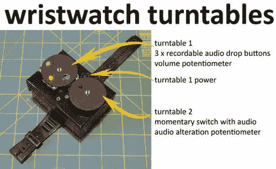

# 手表转盘

> 原文：<https://hackaday.com/2011/03/22/wristwatch-turntables/>

你是否曾希望在使用你已经穿戴好的设备时，还能在飞机上做 DJ？嗯，我们也没有，但现在我们可以，便宜又容易地与手表转盘。虽然功能和时尚，这个有趣的项目是相当容易建设，如果需要，甚至体育全功能的数字手表。

音频电子设备由一对语音/音乐贺卡捐赠。“记录你自己的”和“处理我们给你的”两种类型，不过你选择哪一种取决于你的口味。然后，贺卡被切开，以寻找隐藏的好东西，然后进行一点电路弯曲操作，以摆弄声音模块的放大器。

添加了电位计，重新定位了按钮，所有东西都放在一个小盒子里，中间放了一只手表，这样你就可以穿着整套衣服，在任何地方都可以打出你的时髦节拍。休息之后，请加入我们，观看一段简短的视频。

[https://www.youtube.com/embed/kfFWFbSO8Gk?version=3&rel=1&showsearch=0&showinfo=1&iv_load_policy=1&fs=1&hl=en-US&autohide=2&wmode=transparent](https://www.youtube.com/embed/kfFWFbSO8Gk?version=3&rel=1&showsearch=0&showinfo=1&iv_load_policy=1&fs=1&hl=en-US&autohide=2&wmode=transparent)