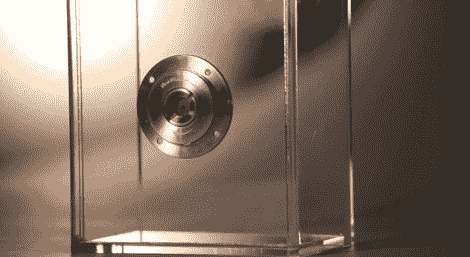

# 万亿像素图像和透明相机:真的还是假的？

> 原文：<https://hackaday.com/2011/03/22/terapixel-images-and-see-through-cameras-real-or-fake/>

又到了你 Hack a Day 的眼尖读者——来决定下面的视频是展示了技术的最佳状态，还是完全是废话的时候了。本版[真假？](http://hackaday.com/tag/real-or-fake/)是由 Hack a Day 读者【Wizzard】带给我们的，他给我们发来了一个“[隐形摄像机](http://www.theinvisiblecamera.com/)的链接

观看下面嵌入的视频，了解这款相机的揭幕，以及它的创造者——摄影师 Chris Marquardt 对其革命性新技术的讨论。相机由一个简单的、不动的镜头组成，镜头安装在一个完全透明的盒子里，盒子由特殊的偏振玻璃制成。这种玻璃应该能够调整环境照明，放大通过镜头的能量，以便曝光他们为相机创造的特殊胶片。

这部电影是使用标准电影“结合化学创新”开发的，以产生超低灵敏度的图像媒体，创作者称之为“定向脱敏”电影。这种薄膜可以在全光照下处理，因为它只对由上述透镜导向其表面的高能光敏感。据称，由于这种特殊的薄膜，相机超越了百万像素，超过了千兆像素，并以万亿像素拍摄图像。

现在，叫我们怀疑，但是愚人节玩笑是不是太早了点？我们只是无法想象任何场景，如视频所示，在阳光下拿着一张胶片，由于环境中大量的反射光，至少在某些区域不会导致它曝光。

你有什么看法？

 <https://www.youtube.com/embed/rWU3-gA3ueo?version=3&rel=1&showsearch=0&showinfo=1&iv_load_policy=1&fs=1&hl=en-US&autohide=2&wmode=transparent>

 </body> </html>