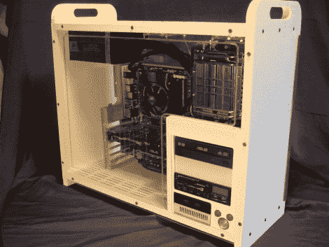

# 使用 CNC 路由器和家庭建筑产品的电脑机箱

> 原文：<https://hackaday.com/2011/03/22/pc-case-using-cnc-router-and-home-building-products/>

[重新发明科学]需要一个项目，他可以用这个项目在他最近购买的一台新的数控镂铣机上测试他的技能。他决定用容易获得的材料制作一个电脑机箱。他最后得到的是上面看到的干净的箱子，它是用你能在家庭商店买到的材料加工而成的。

大部分的情况下，是由挤压聚氯乙烯，旨在履行像实木装饰。他拿起一块“木材”,切割出正面、背面、顶部、底部和驱动器托架挡板。我们期望水平和垂直部分之间的接头要么是对接接头，要么是兔子接头。但是[重新发明科学]想要一个更干净的外观，并设法磨出榫眼和榫头。这些都是强有力的关节，留下了非常漂亮的外观。由于这种材料被设计成木材替代品，所以看到干墙螺丝被用作紧固件也就不足为奇了。

除了细木工之外，还使用了一些其他的 CNC 技巧。表壳的侧面由透明的丙烯酸树脂切割而成，表面磨有装饰珠。顶部还有风扇端口，底部有通风口，光驱上方还有一些刻有项目名称的雕刻。木纹压花打造出有趣的最终外观；我们想看看这需要几层细致的油漆。

如果你对使用的 CNC 硬件感兴趣，看看分享一些细节的拆箱帖子。