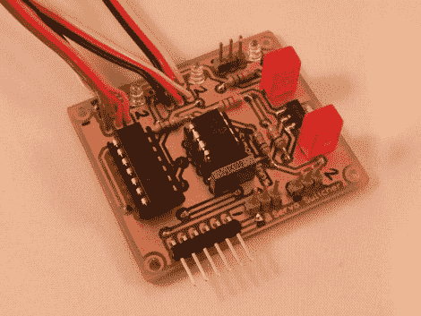

# 自主硬件的 RC 覆盖

> 原文：<https://hackaday.com/2011/03/22/rc-override-for-autonomous-hardware/>

[Simon Inns]开发了这个板，作为自动硬件的无线电控制覆盖。它位于一些伺服电机和两套不同的电机控制器之间。可以控制电机的一组硬件是为自主任务编程的微控制器。在西蒙的案例中，这使得帆船能够在没有人类干预的情况下航行在开阔的水域。但是，如果该板出现故障，或者如果您只是需要将船召回港口，该模块允许传统的射频车辆控制器进行指挥。

上面看到的电路板被称为伺服切换器，使用 PIC 12F683 来监控来自 RF 接收器的输入信号。如果该信号不存在，它将电机的控制切换到一个单独的微控制器板上。这意味着简单地通过打开手持控制器来建立超驰控制。这将节省你游泳取回你的船，这是一个很好的方便。但是如果你为飞机或直升机修改这个，它能使你的飞机免于某种破坏。休息后请观看视频。

[https://www.youtube.com/embed/8sm1w1PV5mw?version=3&rel=1&showsearch=0&showinfo=1&iv_load_policy=1&fs=1&hl=en-US&autohide=2&wmode=transparent](https://www.youtube.com/embed/8sm1w1PV5mw?version=3&rel=1&showsearch=0&showinfo=1&iv_load_policy=1&fs=1&hl=en-US&autohide=2&wmode=transparent)