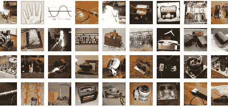

# 高电压:如何用 62 个简单的步骤烹饪你的鹅

> 原文：<https://hackaday.com/2011/03/22/high-voltage-how-to-cook-your-goose-in-62-easy-steps/>

准备学习。[掷弹兵]已经收集了一系列关于交流电的信息,可以安全地称之为超级帖子。在 62 个部分中，他涵盖了无数的主题，其中一些是安全的，许多不是那么安全。你可能想花时间通读他提供的所有内容，但以防万一，第一步是目录。在里面你会发现一个要点列表，包括各种可以想象的变形金刚；从微波炉、霓虹灯、灭虫器、x 光和电视。[掷弹兵]涵盖了这些物品使用的变形金刚的类型，在哪里可以找到它们，以及如何设置你自己的实验。有大量的图片和几个视频展示了高能火花飞舞的地方。我们觉得这里有足够的东西让我们在安全地坐在显示器前，远离令人心跳停止的动作时，对替代交流互动感到满意。

[谢谢马库斯]