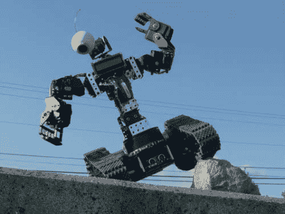

# 遥控坦克履带机器人将为你遛狗

> 原文：<https://hackaday.com/2011/03/22/remote-controlled-tank-tread-robot-will-walk-the-dog-for-you/>

Instructables 用户[IAMTHEBOT]最近[完成了他的机器人](http://www.instructables.com/id/AutonomousRC-Human-Bot)的建造，它可以由人类使用遥控发射器、通过 PC 或通过其内置的物体回避系统来控制。这个机器人似乎没有名字，虽然约翰尼五号可能是合适的。

这个机器人使用了大量的安装器组件，以及一套 Lynx 运动坦克踏板套件。这个机器人塞满了控制器，包括一个操作手臂的螺旋桨 USB 伺服控制器，和一对管理踏板运动的视差电机控制器。一对视差印章控制器用于驱动这些控制器以及管理机器人的其余功能。

机器人的头部由一个定制的云台无线摄像头系统组成，这使他可以在家中舒适地驾驶它，同时在 PC 上观看视频流。该机器人还能够自主漫游，使用 ping 传感器避开物体，该传感器可以安装在摄像机当前所在的位置。似乎只差史蒂夫·加顿伯格了。

正如你在下面的视频中看到的，这个机器人在各种表面上都管理得很好，甚至可以遛这个人的狗。

[https://www.youtube.com/embed/lLuBOUzhSWc?version=3&rel=1&showsearch=0&showinfo=1&iv_load_policy=1&fs=1&hl=en-US&autohide=2&wmode=transparent](https://www.youtube.com/embed/lLuBOUzhSWc?version=3&rel=1&showsearch=0&showinfo=1&iv_load_policy=1&fs=1&hl=en-US&autohide=2&wmode=transparent) [https://www.youtube.com/embed/jgGu_RPKA-w?version=3&rel=1&showsearch=0&showinfo=1&iv_load_policy=1&fs=1&hl=en-US&autohide=2&wmode=transparent](https://www.youtube.com/embed/jgGu_RPKA-w?version=3&rel=1&showsearch=0&showinfo=1&iv_load_policy=1&fs=1&hl=en-US&autohide=2&wmode=transparent)