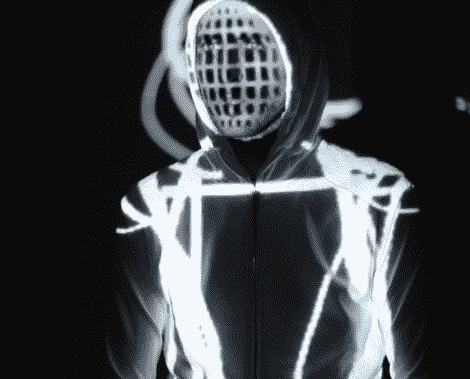

# Kinect 实时线框视频效果叠加

> 原文：<https://hackaday.com/2011/03/23/real-time-wireframe-video-effect-overlay-with-kinect/>

[Francois]在 1024 Architecture [一直在做一个项目](http://1024d.wordpress.com/2011/03/21/make-the-line-dance-video)我们认为你很快就会在专业音乐视频中看到。利用他的 Kinect 传感器，ha 一直在跟踪骨骼运动，并用 Quartz Composer 为最终的线框添加特殊效果。虽然这个想法并不新鲜，但下一部分却很新鲜。他将 QC 调整后的视频流投射回表演者身上，使用 MadMapper 将视频与身体运动进行匹配，记录最终的显示。

该项目开始时有一些小问题，包括身体跟踪和显示之间的明显延迟。这导致表演者不得不移动得比他想要的更慢，所以事情不得不被调整。[Francois]首先通过在屏幕上和投影仪上显示时间码来测试他的计算机和投影仪之间的延迟。他发现投影仪在 60 fps 时有 1 帧的延迟，这还不算太差。这让他相信罪魁祸首是他的 Kinect，他是对的。有 6 帧的延迟，所以他将视频输出锁定为 30 fps，希望将延迟减半。

这种效果有点像 Tron，但失真更多。我们迫不及待地想在未来看到更多类似这样的项目。

在我们看来，下面嵌入的结果视频非常酷，但你可以自己判断。

[https://player.vimeo.com/video/21308228](https://player.vimeo.com/video/21308228)