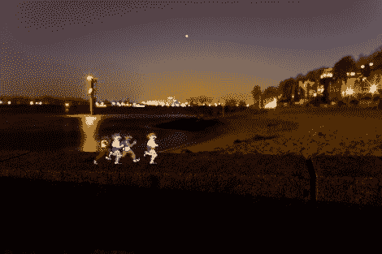

# 用模版拍摄不存在的东西

> 原文：<https://hackaday.com/2011/03/23/photographing-stuff-thats-not-there-by-using-stencils/>

这张图片不是后期制作的，而是在长时间相机曝光过程中拍摄的。该方法使用模板将组件添加到图片中。[Alex]用一个纸板箱为他的照相机做了一个夹具。这个夹具将一个大框架放在相机镜头的前面，在那里可以插入印刷好的模板。他打印了两张相同的纸，黑色覆盖了 8 位慢跑者周围的区域。当正确对齐并插入夹具中时，模板的黑色部分将掩盖他想要捕捉图像自然环境的区域。一旦相机快门被触发，他用闪光灯照亮模板，然后从夹具上取下纸张图像，在剩余的 20-30 秒曝光时间内捕捉黑暗环境中的环境光。真正的技巧是让闪光灯和环境光之间的亮度达到平衡，并产生如上图所示的效果。

现在还有人在脑子里听到过场音乐吗？