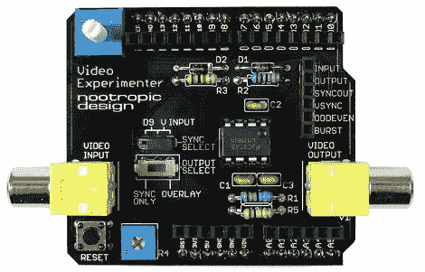

# 视频实验者屏蔽

> 原文：<https://hackaday.com/2011/03/24/video-experimenter-shield/>

人们总是希望事半功倍，视频实验者 Shield 也不例外。由一个 [LM1881](http://www.national.com/mpf/LM/LM1881.html#Overview) 视频同步分离器、一些无源元件和一个标准 Arduino shield 封装的时尚 PCB 组成。

该板具有简单但有用的控制和功能，可拆卸跳线允许您从输入视频或 Arduino 中选择同步源，电位计用于调整模拟阈值，还有一个方便的信号分接头。

软件是流行的[电视输出库](http://hackaday.com/?s=tv+out+library)的增强版本，允许你从视频图形叠加、隐藏字幕解码、简单的枪战游戏、基本但仍然有效的帧捕捉和计算机视觉开始。当然，一旦你在休息后看了一个快速演示视频，还有各种各样其他有趣的实验开始浮现在你的脑海中。

[https://www.youtube.com/embed/TGy70XxhpMY?version=3&rel=1&showsearch=0&showinfo=1&iv_load_policy=1&fs=1&hl=en-US&autohide=2&wmode=transparent](https://www.youtube.com/embed/TGy70XxhpMY?version=3&rel=1&showsearch=0&showinfo=1&iv_load_policy=1&fs=1&hl=en-US&autohide=2&wmode=transparent)