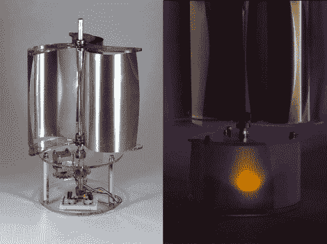

# 低压风力涡轮机照明

> 原文：<https://hackaday.com/2011/03/24/low-voltage-wind-turbine-lighting/>

Instructables 用户[Dustyn]最近[建造了一个基于风力的灯笼](http://www.instructables.com/id/Wind-Lantern-LEDs-powered-by-a-vertical-axis-wind)，为城市环境提供一点免费的可再生能源。该项目基于垂直轴风力涡轮机，她说这种风力涡轮机更适合这些环境，因为风经常来自各个不同的方向。尽管与水平轴涡轮机相比，它们的效率较低，但这种类型的涡轮机似乎非常适合她的需求。

她提供了一份完整的材料清单，包括复制她的作品所需的最后一颗螺丝和垫圈。风帆由薄铝防水板制成，插在两块丙烯酸板之间。这些然后被安装到涡轮机的中心铝轴上，该轴驱动内置在底座中的步进电机。

来自步进电机的电流经过整流并流经一对电容器，然后用于点亮相连的 LED。这使得双极电机能够提供电流，而不管涡轮机转动的方向如何，并且盖子使事情变得平滑，这样 led 就不会在不同的风力条件下疯狂闪烁。涡轮机不会照亮整个城市街区，但它绝对是太阳瓶的一个不错的替代品。

留下来看一段涡轮机运转的视频。