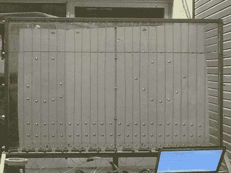

# 气泡显示

> 原文：<https://hackaday.com/2011/03/25/bubble-display/>

作为黑客，我们想出了一些非常疯狂和独特的方式来显示数据，但这从未阻止我们创造更疯狂的方式，如这个[气泡显示](http://www.jbprojects.net/projects/bubbledisplay/)。受一篇名为[液体显示器](http://hackaday.com/2008/07/29/the-liquid-display/)的黑客文章的启发，气泡显示器最初是一个单列的 lexan 罐，因此团队可以检查不同的液体，并建立方法，这给了他们在地下室测试湿/干真空的机会。

在解决了原型中的泄漏后，尝试了不同的液体以查看哪种效果最好，甘油(虽然是 3 个测试项目中最贵的)在气泡如何升到顶部以及每个气泡的均匀性方面表现最佳。

最终的坦克设计特点(24？)通道，以防止气泡相互作用，并装有一些帕克 A005-C23-2P 气动阀，连接到标准空气压缩机上。在电气方面，它非常标准，solinoid 驱动程序全部由 PIC18F4455 运行，时钟频率为 48MHz。

软件方面，该设备有 3 种模式，一种模式允许用户使用用 Visual Basic 编写的家酿 GUI 从计算机输入文本或简单的位图，还有一个演示循环，用于当你仍然想炫耀它时，但没有人不断地将数据输入其中，最后是一个实时键盘模式，当有键盘通过 MIDI 连接时，它可以充当气泡音乐可视化工具。休息之后，请观看一段简短的视频，了解这三个问题。

 <https://www.youtube.com/embed/4cQ-oU3LidA?version=3&rel=1&showsearch=0&showinfo=1&iv_load_policy=1&fs=1&hl=en-US&autohide=2&wmode=transparent>

 </body> </html>