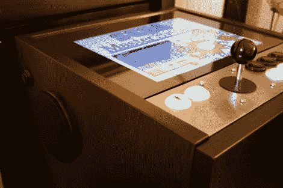

# 宜家家具赋予 Mame 橱柜生命

> 原文：<https://hackaday.com/2011/03/25/mame-cabinet-springs-to-life-from-ikea-furniture/>

[杰德]把一个 MAME 橱柜做成一些平板包装家具([翻译成](http://translate.google.com/translate?js=n&prev=_t&hl=en&ie=UTF-8&layout=2&eotf=1&sl=auto&tl=en&u=http%3A%2F%2Fmamenetbook.blogspot.com%2F))。他选择了[的宜家 Ramvik 边桌](http://www.ikea.com/us/en/catalog/products/50103717)。这是这个项目的完美家具，原因有几个:它很便宜，不到 70 美元，坐在沙发上使用时高度合理，它有一个内置抽屉，可以隐藏系统的内部，它的设计是使用一块玻璃作为桌面。

电子设备非常简单。一台笔记本电脑运行 MAME 前端，一个辅助屏幕被很好地框在玻璃下面。控件是标准的投币式按钮，通过 USB 操纵杆焊接到 PCB 上的触点上。添加到桌子表面的拉丝铝边框保持了现代的成品外观，这是人们想要的展示品。

在逛宜家时，我们总是喜欢留意可梳理的物品。一定要去看看他们的“原样”部门(最好是一开门就去),找到便宜的可折叠家具。