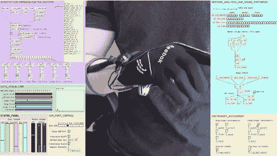

# SudoGlove 获得了一个大的软件升级

> 原文：<https://hackaday.com/2011/03/26/sudoglove-gets-a-big-software-upgrade/>

[Jeremy Blum]最近为他的 SudoGlove 系统编写了几个软件包，将它变成了一个具有许多功能的音乐控制器。我们已经在之前的帖子中看到了硬件[，作为这次迭代的目标，他决定不改变硬件或控制它的固件——使这成为一个 PC 端的纯软件黑客。很高兴看到原始想法的改进，因为我们觉得在开发者的兴趣减弱后，我们覆盖的大多数基于手套的项目最终都被扔进了垃圾箱。](http://hackaday.com/2010/05/10/more-glove-based-interfaces/)

休息之后，你可以看到和听到完整系统的演示。显示的应用程序前端~~是使用 Processing 编写的，并且~~包括手套本身上每个传感器的一系列用户配置。在引擎盖下,[Jeremy]构建了[的 PureData 框架](http://puredata.info/),以真正释放将物理运动转化为合成声音的潜力。还有一个视觉反馈应用程序，可以帮助你练习你的动作，如果你正在进行现场表演，每个手指都是不同的乐器，这很重要。这个项目的所有东西，包括硬件和软件，都是在 CC 许可下发布的，所以如果你对他所做的部分或全部优秀工作感兴趣，请访问[Jeremy 的]网站。

**更新:** [Jeremy]对我们的大纲做了一点修改。视频中显示的应用程序完全是用 PureData 编写的，可视化调试器是用 Processing 编写的。这两个是独立的包，互不依赖。他还给我们[发了一个下载代码包](http://jeremyblum.com/tag/sudoglove/)的链接。

[https://www.youtube.com/embed/4bXEzAOvSrc?version=3&rel=1&showsearch=0&showinfo=1&iv_load_policy=1&fs=1&hl=en-US&autohide=2&wmode=transparent](https://www.youtube.com/embed/4bXEzAOvSrc?version=3&rel=1&showsearch=0&showinfo=1&iv_load_policy=1&fs=1&hl=en-US&autohide=2&wmode=transparent)