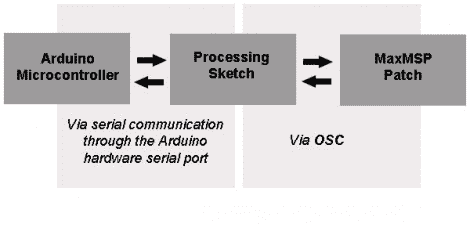

# Arduino 和不带以太网屏蔽的开放式声音控制

> 原文：<https://hackaday.com/2011/03/27/arduino-and-open-sound-control-without-an-ethernet-shield/>

开放式声音控制(OSC)是一种通信协议，可以被视为 MIDI 的现代替代方案。它是专门为网络通信系统设计的。将它与基于 Arduino 的小工具一起使用的问题是，您需要使用类似以太网屏蔽的东西来提供网络连接。[Liam Lacey]决定[使用处理作为 OSC 和 Arduino](http://liamtmlacey.blogspot.com/2011/03/arduino-to-maxmsp-via-osc-guide-and.html) 的中间人，代替以太网屏蔽。这种方法的主要好处之一是，当谈到 Arduino 如何通信时，它为您提供了一些灵活性。由于 USB 连接的 Arduino 可以通过处理草图以与 AVR 芯片通过 RS232 串行端口连接相同的方式进行寻址，因此[Liam 的]方法将允许您在 Arduino 板上制作原型，但过渡到您自己的非 USB 硬件以完成项目。这种方法的一个大缺点是需要有一台计算机连接到您的控制器，但我们打赌您无论如何都需要一台计算机来运行 MAXmsp。