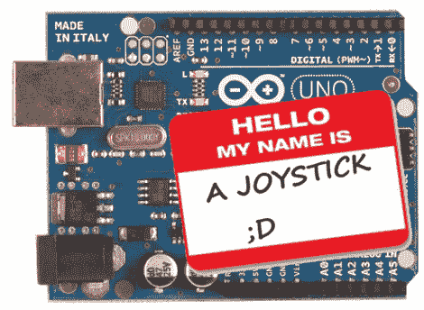

# HIDUINO:你的 Arduino 现在是一个 MIDI 接口

> 原文：<https://hackaday.com/2011/03/28/hiduino-the-only-limit-is-yourself/>

[Dimitri Diakopoulos]来到我们的热线，让我们知道他的[HIDUINO](http://mtiid.calarts.edu/research/hiduino)项目。HIDUINO 是用于 Arduino 新版本(例如 Uno 和 Mega2560)的 ATmega8u2 的一组固件。一旦 HIDUINO 被加载，你的 Arduino 可以显示为任何你想要的 HID 兼容设备，不需要额外的驱动程序。这意味着使用这种固件，音乐软件如 Max，Ableton，Reaktor 等可以直接从 Arduino 读取和写入 MIDI。目前，该项目是直接 USB-MIDI 通信，但可以改变作为各种 HID 设备。

使用您自己的设备类型或名称来刷新 ATmega8u2 需要开发人员做一些工作，例如拥有一名 ISP 程序员，将头部引脚焊接到电路板上，以及每次您想要将新代码加载到 Arduino 中时重新刷新 ATmega8u2。没有 ISP 的用户仍然可以使用 [Atmel 的 FLIP 软件](http://www.atmel.com/dyn/products/tools_card.asp?tool_id=3886) (Windows)或 [DFU 程序员](http://dfu-programmer.sourceforge.net/) (Mac OS X 和 Linux)和预编译的 HIDUINO 固件来刷新 HIDUINO。他们仍然需要在电路板的下面焊接一个[跳线](http://www.ladyada.net/library/arduino/unofaq.html)来使用 DFU 引导程序。

这个固件肯定会让任何人受益，他们可以构建一个 [Arduinome](http://hackaday.com/tag/arduinome/) 、[操纵杆](http://hackaday.com/2010/11/19/arduino-java-joystick/)或任何[种类的设备，用户只需将其连接到 PC 而无需额外的软件。](http://hackaday.com/2011/03/16/robotouch-adds-physical-game-controls-to-the-ipad/)

ISP 闪存指南可在[Dimitri]的[网站](http://code.google.com/p/hiduino/wiki/UsingHiduinoISP)找到。