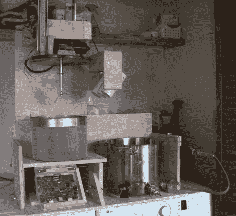

# 自动化家庭啤酒厂——有史以来最好的洗衣房附件

> 原文：<https://hackaday.com/2011/03/28/automated-home-beer-brewery-best-laundry-room-add-on-ever/>

全谷物家庭酿造需要时间…很多时间。我们不会假装一批好的啤酒不是主要归功于酿酒大师这位艺术家，但与此同时，看到像上面这样一个紧凑的[系统可以在没有你太多帮助的情况下煮沸一批麦芽汁](http://www.renesasrulz.com/docs/DOC-1786)也是非常令人惊讶的。

[Zizzle]制造了这台机器作为他参加瑞萨竞赛的参赛作品。你可以看到开发板就在冲泡壶的左边。它的网络与一个网络接口相连，允许你从 [Brewtarget](http://brewtarget.sourceforge.net/) 获取食谱，并直接导入系统。你所需要做的就是确保你装载了谷物篮子和煮沸添加模块来匹配你的食谱。机器人从那里拿起它，装满水壶，预热水，降低谷物并保持糖化醪的温度，并通过伺服控制的 PVC 管豆荚完成煮沸。有经验的酿酒师会注意到少了几个步骤，如喷雾，以及冷却成品麦芽汁的快速方法。但这确实让我们摆脱了很大一部分苦差事。如果它有一个原地清洁系统…那我们真的会很开心！休息之后不要错过视频，花点时间看看[的构建日志帖子](http://zizzle-brewbot.blogspot.com/)。

 <https://www.youtube.com/embed/4xQenrnkNOQ?version=3&rel=1&showsearch=0&showinfo=1&iv_load_policy=1&fs=1&hl=en-US&autohide=2&wmode=transparent>

 </body> </html>