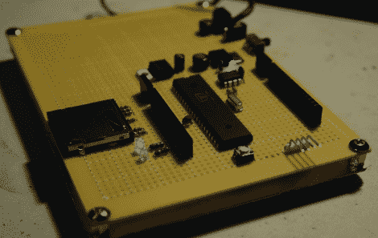

# 螺旋桨原型板让你立刻飞起来

> 原文：<https://hackaday.com/2011/03/29/propeller-proto-board-has-you-flying-in-no-time/>

[Parker] [需要一个螺旋桨开发板](http://www.longhornengineer.com/DIY/PropDev)来简化他的项目。通常情况下，当他需要制作某样东西的原型时，他会从他自制的弹球机中取出手头仅有的一个，并在完成后放回原处。这既费时又麻烦，所以他决定需要一种更好的做事方式。

他考虑购买一个小工具强盗原型板，它可以让你使用一个很像 Arduino 的螺旋桨，完全支持盾牌之类的东西。不幸的是，票已经卖完了，他正急着完成一个项目。他没有等待，而是决定建立自己的原型板，这将比 COTS 版本更灵活，允许他添加类似模数转换器的东西，而不必使用屏蔽。

他在网上看了看，找到了一些要遵循的原理图，很快就完成了他的原型板。它完成了工作，看起来很干净，考虑到它是用 perf 板组装的。

请继续阅读，观看 Propeller 开发板构建的视频演示。

[https://www.youtube.com/embed/Tc5mCpTmNBs?version=3&rel=1&showsearch=0&showinfo=1&iv_load_policy=1&fs=1&hl=en-US&autohide=2&wmode=transparent](https://www.youtube.com/embed/Tc5mCpTmNBs?version=3&rel=1&showsearch=0&showinfo=1&iv_load_policy=1&fs=1&hl=en-US&autohide=2&wmode=transparent)