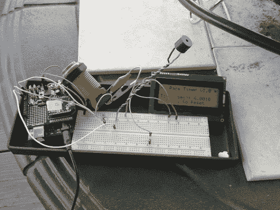

# 无线无舵雪橇计时器让比赛变得公平

> 原文：<https://hackaday.com/2011/03/29/wireless-luge-timer-levels-the-playing-field/>

在科罗拉多州，业余无舵雪橇比赛是一件严肃的事情。

每年冬天，[莱恩的]朋友们都会在占据他们院子的几英尺厚的积雪中挖一条长长的雪橇跑道，然后举行雪橇比赛，看谁能在最短的时间内从这座巨大的山上滑下来。他们称之为马里奥杯，以其中一名参与者的名字命名，而不是任天堂的吉祥物，他们急需一些计时设备。

你看，雪橇赛道有几百英尺长，他们认为一个拿着秒表的人不足以选出决定性的冠军。一组三个 Arduino 传感器装在塑料食品容器内，与光传感器一起用于跟踪 luger 何时通过比赛的起点、中点和终点线。XBee 无线电然后将定时数据传输回基站进行记录。

据参与者称，该系统运行良好，他们期待将来再次使用该系统。当然，改进已经计划好了，包括在每个检查站安装双计时器来测量鲁格手枪的速度，以及像你在短程加速赛中看到的圣诞树启动信号。

继续阅读下面的视频，看看鲁格手枪的动作，以及正在进行一些测试的计时系统。

[通过[使](http://blog.makezine.com/archive/2011/03/homebrew-luge-track-comes-complete-with-electronic-timers.html)

 <https://www.youtube.com/embed/r95RXY9zeGA?version=3&rel=1&showsearch=0&showinfo=1&iv_load_policy=1&fs=1&hl=en-US&autohide=2&wmode=transparent>

 </body> </html>