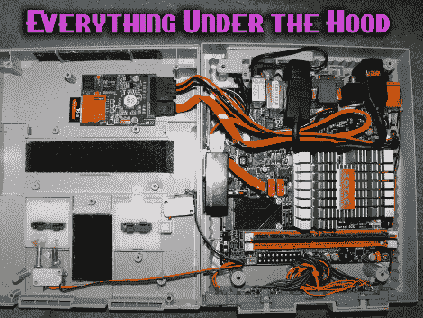

# SNES 至保时捷中心

> 原文：<https://hackaday.com/2011/03/30/snes-to-pc/>

任天堂娱乐系统是目前最受欢迎的 8 位碰撞后视频游戏系统。因此，NES 得到了各种各样的修改和破解，但它的更大的 16 位兄弟超级任天堂却没有一大堆噪音。不要害怕，虽然(维哥喀尔巴阡山)(我不知道这是邪恶的季节！)在他的第一款 Instructable 中帮助纠正了这一点，将 SNES 变成了集经典视频游戏玩家于一身的[。](http://www.instructables.com/id/Turn-a-Super-NES-into-an-All-In-One-Classic-Video-/)

使用超级任天堂的外壳，下半部分包括 ZOTAC IONITX-C-U 迷你 ITX 主板，以及双 SNES 控制器端口 USB，适合在原始开口中使用 real deal 控制器。还安装了一个 USB 端口，用于一些无线双冲击动作。

在上半部分，弹出按钮和墨盒插槽挡板已被删除，并添加了扬声器格栅布以提供通风。在设备背面附近，SD 卡到 SATA 适配器提供存储，我们认为这是一个便宜的 SSD 存储的好主意。微型开关也被装配起来，以便原来的电源和复位按钮控制同样的计算机功能。

简洁的外观，小巧的外形，休息后加入我们，观看一段视频。

 <https://www.youtube.com/embed/bYrPk6g8Weg?version=3&rel=1&showsearch=0&showinfo=1&iv_load_policy=1&fs=1&hl=en-US&autohide=2&wmode=transparent>

 </body> </html>