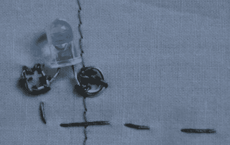

# 依偎着哈金柔软的一面

> 原文：<https://hackaday.com/2011/03/30/snuggle-up-with-the-softer-side-of-hacking/>

并非所有的黑客都需要由伺服电机、无线电和 PIR 传感器组成。有时候黑客也有温柔的一面，这一点[Katie] [用她的最新作品](http://kaytdek.trevorshp.com/projects/conductive/artStudi178/quilt.htm)提醒了我们。

她的 LED 被子包含 64 个手工缝制的 LED，所有这些都是用导电线精心附着的。同样的线被用在缝纫机上来建造给发光二极管供电的导电网格。电路的一半以 8 行的形式缝在被子的前面，而列缝在背面。所有的行和列在被子的角落相遇，在那里它们通过简单的金属搭扣连接到 Lilypad Arduino。

然后对 LED 矩阵面板进行测试，然后缝制成一床真正的被子。成品看起来完全无害，直到点燃，正如你在下面的视频中看到的。我们认为这将是一个很好的儿童夜灯替代品，特别是如果编程显示舒缓的光模式。

[通过[使](http://blog.makezine.com/archive/2011/03/led-matrix-quilt.html)

【维梅奥 http://vimeo.com/20846646 w = 470】

[vimeo http://vimeo.com/20969368 w=470]